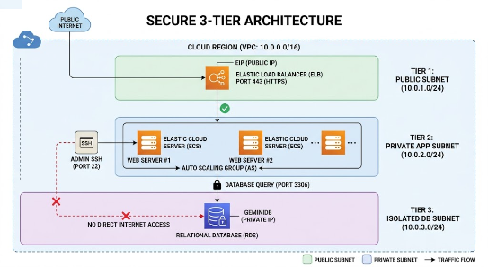

# Secure 3-Tier Enterprise Cloud Infrastructure

## 🎯 Project Objective
This project demonstrates a production-ready, high-availability cloud environment designed for a multinational scale. It follows the **Principle of Least Privilege**, ensuring that sensitive database layers are completely isolated from the public internet.

## 🏗️ Architecture Diagram

## 🛠️ Design Decisions
* **Three-Tier Isolation:** Separating the Web, App, and Database layers ensures that a breach in one layer does not compromise the others.
* **Security Groups:** Implemented stateful firewalls to restrict lateral movement between subnets.
* **Elastic Load Balancing:** Configured to handle traffic spikes and provide a single entry point via Port 443 (HTTPS).

## 📄 Documentation Links
* [Network Specifications](./network_specs.md)
* [Step-by-Step Setup Guide](./setup_guide.txt)

---
**Author:** Jamilur Reza Sayed  
*Computer Science Engineer | Cloud Specialist*
